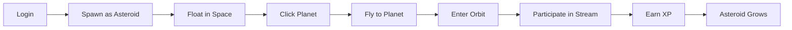

# 🌞 Solar System Universe - Spaces Manager Documentation

## 📋 Table of Contents
1. [Overview](#overview)
2. [Core Concept](#core-concept)
3. [Visual Elements](#visual-elements)
4. [User Interactions](#user-interactions)
5. [Reward Mechanics](#reward-mechanics)
6. [Technical Architecture](#technical-architecture)
7. [Implementation Status](#implementation-status)
8. [Future Roadmap](#future-roadmap)

---

## 🌌 Overview

The **Solar System Universe** is an innovative 3D visualization system for managing livestream spaces, X Spaces, and virtual events. It transforms traditional flat UI management into an immersive cosmic experience where every element has meaning and purpose.

### Key Features:
- **Real-time 3D visualization** of livestream ecosystems
- **Gamified user engagement** with XP and leveling
- **Visual reward mechanics** (comets, explosions, trails)
- **Intuitive spatial navigation** between channels
- **Live activity monitoring** through visual cues

---

## 🎯 Core Concept

### The Universe Metaphor

```
🌞 SUN = Main Broadcast/Stage
   ├── 🌍 PLANETS = Different Channels/Topics
   │   └── 🌙 MOONS = Sub-streams/Breakout Rooms
   │
   ├── ☄️ COMETS = Super Chats/Donations
   ├── 🛸 SATELLITES = Moderators/Bots
   ├── 💫 ASTEROIDS = Users/Viewers
   └── 💍 RINGS = Featured/Promoted Streams
```

### Why Solar System?

The solar system metaphor provides:
- **Natural Hierarchy**: Sun → Planets → Moons mirrors Main Event → Channels → Sub-rooms
- **Orbital Mechanics**: User movement feels natural and physics-based
- **Visual Scale**: Size directly represents importance/activity
- **Dynamic Activity**: Constant motion represents live, active spaces

---

## 🎨 Visual Elements

### 1. The Sun (Main Broadcast)
```typescript
{
  role: "Central hub/main stage",
  visual: "Glowing sphere with corona effects",
  shader: "Solar flares + pulsing",
  interaction: "All planets orbit around it",
  represents: "The main event or primary broadcast"
}
```

**Visual Behaviors:**
- Pulsates with overall system activity
- Solar flares increase with major events
- Corona brightness = total viewer count

### 2. Planets (Channels/Rooms)
```typescript
{
  role: "Individual streaming channels",
  visual: "Colored spheres in orbit",
  properties: {
    size: "Based on viewer count",
    color: "Channel category/theme",
    glow: "Chat activity level",
    orbit_speed: "Engagement rate"
  }
}
```

**Dynamic Properties:**
| Property | Represents | Visual Effect |
|----------|------------|--------------|
| Size | Viewer Count | Larger = more viewers |
| Glow Intensity | Chat Activity | Brighter = more active |
| Orbit Speed | Engagement | Faster = higher engagement |
| Rings | Featured Status | Saturn-like rings when promoted |

### 3. Moons (Sub-channels)
```typescript
{
  role: "Breakout rooms or sub-streams",
  visual: "Small spheres orbiting planets",
  parent: "Specific planet/channel",
  examples: ["VIP Lounge", "Backstage", "Q&A Room"]
}
```

### 4. Asteroids (Users)
```typescript
{
  role: "Individual users/viewers",
  visual: "Small floating rocks",
  properties: {
    size: "User level/reputation",
    color: "User role (viewer/sub/mod)",
    trail: "Activity streak",
    glow: "Currently active in chat"
  }
}
```

**Color Coding:**
- 🔵 Blue = Free viewer
- 💜 Purple = Subscriber
- 🟡 Gold = Moderator
- ⚪ White = Admin
- 🟢 Green = VIP

### 5. Comets (Rewards/Donations)
```typescript
{
  role: "Super chats, donations, gifts",
  visual: "Bright object with trailing particles",
  animation: "Flies from sender to target channel",
  impact: "Explosion effect on arrival"
}
```

**Animation Sequence:**
1. **Launch**: Comet spawns at sender's position
2. **Flight**: Travels with glowing trail
3. **Impact**: Explodes in fireworks at destination
4. **Notification**: Channel pulses to acknowledge

### 6. Satellites (Moderators/Bots)
```typescript
{
  role: "Automated moderation or bot services",
  visual: "Mechanical objects orbiting planets",
  features: {
    scanning_beam: "Active moderation",
    red_flash: "User ban action",
    green_pulse: "Welcome message"
  }
}
```

---

## 🎮 User Interactions

### Navigation Controls

| Action | Input | Result |
|--------|-------|--------|
| Orbit Camera | Left Mouse Drag | Rotate view around solar system |
| Zoom In/Out | Mouse Wheel | Change viewing distance |
| Select Planet | Click on Planet | Focus camera on that channel |
| Join Channel | Double-click Planet | User asteroid enters orbit |
| Send Reward | Click "Super Chat" | Launch comet animation |
| View Stats | Hover over Planet | Display info tooltip |

### User Journey Flow



### Interactive Features

1. **Channel Switching**
   - Click on different planet → Asteroid flies to new destination
   - Smooth GSAP animation between locations
   - Trail effect shows movement path

2. **Live Reactions**
   - Send emoji → Small particle burst from your asteroid
   - Type in chat → Asteroid glows briefly
   - Send gift → Launch comet toward streamer

3. **Social Features**
   - See other users as asteroids in same orbit
   - Larger asteroids = higher level users
   - Formation flying for group activities

---

## 🏆 Reward Mechanics

### XP System

| Action | XP Earned | Visual Effect |
|--------|-----------|--------------|
| Join Stream | +10 XP | Asteroid enters orbit |
| Chat Message | +5 XP | Brief glow effect |
| Stay 10 mins | +20 XP | Size increase animation |
| Send Gift | +50 XP | Comet launch |
| Get Featured | +100 XP | Orbital ring appears |
| Daily Streak | +30 XP/day | Longer trail effect |

### Level Progression

```typescript
Level 1-10:   Pebble     (0.1 size)
Level 11-25:  Rock       (0.2 size) 
Level 26-50:  Boulder    (0.3 size)
Level 51-100: Asteroid   (0.5 size)
Level 100+:   Mega-roid  (0.7 size + special effects)
```

### Achievement Badges

Achievements manifest as visual modifications:

| Achievement | Requirement | Visual Reward |
|-------------|-------------|---------------|
| Explorer | Visit 10 channels | Blue trail particles |
| Socialite | 1000 chat messages | Pulsing glow aura |
| Supporter | Send 10 super chats | Golden comet trail |
| Veteran | 30-day streak | Orbital rings |
| Whale | $100+ donated | Rainbow particle effects |

### Gamification Events

1. **Meteor Showers** (Special Events)
   - Random meteor particles rain down
   - Click to collect bonus XP
   - Limited time events

2. **Constellation Challenges**
   - "Visit 5 planets in one session"
   - "Form a pattern with other users"
   - Rewards: Special trails or colors

3. **Black Hole Events**
   - Rare wormhole appears
   - Enter to discover secret channels
   - Exclusive rewards for explorers

---

## 🛠 Technical Architecture

### Technology Stack

```typescript
{
  "3D Engine": "Three.js",
  "Animation": "GSAP",
  "Post-Processing": "EffectComposer",
  "Controls": "OrbitControls",
  "State Management": "React Hooks",
  "Real-time Updates": "WebSockets (planned)",
  "Backend Integration": "REST API (planned)"
}
```

### Core Components

#### 1. Scene Setup
```typescript
// Main elements
- Scene: THREE.Scene
- Camera: PerspectiveCamera (60° FOV)
- Renderer: WebGLRenderer (antialiasing enabled)
- Lighting: PointLight (sun) + AmbientLight
- Controls: OrbitControls with damping
```

#### 2. Shader System
```glsl
// Custom shaders for:
- SunShader: Corona effects + solar flares
- CometShader: Trail particles with alpha fade
- BarrierShader: Quantum effects (future)
```

#### 3. Animation System
```typescript
// GSAP-powered animations:
- Planet orbits (continuous rotation)
- Comet flights (point-to-point)
- User movements (smooth transitions)
- Explosion effects (particle bursts)
```

#### 4. Performance Optimizations
- Instance rendering for asteroids (50k+ objects)
- LOD (Level of Detail) for distant objects
- Frustum culling for off-screen elements
- Texture atlasing for particle effects

### Data Structure

```typescript
interface SolarSystem {
  sun: {
    intensity: number;
    flareActivity: number;
  };
  planets: Planet[];
  users: UserAsteroid[];
  comets: ActiveComet[];
  events: SystemEvent[];
}

interface Planet {
  id: string;
  name: string;
  streamData: {
    viewerCount: number;
    chatActivity: number;
    isLive: boolean;
    isFeatured: boolean;
  };
  physics: {
    orbitRadius: number;
    orbitSpeed: number;
    rotationSpeed: number;
  };
  visuals: {
    size: number;
    color: THREE.Color;
    emissiveIntensity: number;
  };
}
```

---

## 📊 Implementation Status

### ✅ Completed Features

- [x] Basic solar system with sun, planets, orbits
- [x] Planet information display panels
- [x] User level/XP display
- [x] Comet (super chat) animation system
- [x] Asteroid (user) spawning and movement
- [x] Post-processing (bloom effects)
- [x] Camera controls (orbit, zoom)
- [x] UI overlay with channel list
- [x] View mode selector (overview/planet/first-person)

### 🚧 In Progress

- [ ] WebSocket integration for real-time updates
- [ ] User authentication flow
- [ ] Persistent XP/level storage
- [ ] Advanced particle effects
- [ ] Sound effects and spatial audio

### 📅 Planned Features

- [ ] Voice chat integration (spatial audio)
- [ ] Screen sharing on planet surfaces
- [ ] NFT badges as visual modifications
- [ ] Multiplayer cursor tracking
- [ ] Mobile VR support
- [ ] AI-powered event recommendations

---

## 🚀 Future Roadmap

### Phase 1: Core Functionality (Current)
- Basic visualization ✅
- User representation ✅
- Channel navigation ✅
- Reward animations ✅

### Phase 2: Live Integration (Q1 2025)
- WebSocket real-time updates
- Actual X Spaces API integration
- User authentication
- Persistent progression

### Phase 3: Social Features (Q2 2025)
- Voice chat bubbles
- Friend system (gravity attraction)
- Guild formations
- Collaborative events

### Phase 4: Advanced Gamification (Q3 2025)
- Skill trees for users
- Channel ownership mechanics
- Economic system (tokens/credits)
- Competitive leaderboards

### Phase 5: Metaverse Expansion (Q4 2025)
- Multiple solar systems (genres)
- Intergalactic travel
- User-created planets
- DAO governance visualization

---

## 🔗 Integration Points

### X (Twitter) Spaces API
```typescript
// Planned integration
interface XSpacesData {
  spaceId: string;
  title: string;
  hostId: string;
  speakerCount: number;
  listenerCount: number;
  isLive: boolean;
  scheduledStart?: Date;
}
```

### Wallet Integration
```typescript
// Solana wallet for rewards
interface WalletRewards {
  address: string;
  balance: number;
  nftBadges: Badge[];
  transactionHistory: Transaction[];
}
```

### Analytics Dashboard
```typescript
// Track user engagement
interface Analytics {
  totalTimeWatched: number;
  channelsVisited: number;
  interactionCount: number;
  rewardsEarned: number;
  socialConnections: number;
}
```

---

## 🎯 Use Cases

1. **Live Event Management**
   - Visualize multiple simultaneous streams
   - Monitor engagement in real-time
   - Identify trending topics by planet size

2. **Community Building**
   - See where your friends are watching
   - Join channels together (group orbits)
   - Build reputation through participation

3. **Content Discovery**
   - Explore new channels visually
   - Featured planets with rings
   - Recommendations based on orbit patterns

4. **Monetization Visualization**
   - See donations as comets in real-time
   - Track revenue flow between channels
   - Gamify supporter engagement

---

## 🤝 Contributing

To extend the Solar System Universe:

1. **Add New Planet Types**
   - Edit `planets` array in `SolarSystemScene.tsx`
   - Define unique colors and properties
   - Add category-specific shaders

2. **Create New Visual Effects**
   - Add shaders to shader collection
   - Implement in animation loop
   - Use GSAP for smooth transitions

3. **Implement Real Data**
   - Replace sample data with API calls
   - Add WebSocket listeners
   - Update state reactively

---

## 📝 Summary

The Solar System Spaces Manager transforms livestream management from a mundane task into an engaging, visual experience. By representing digital spaces as celestial bodies, we create an intuitive, beautiful, and gamified interface that encourages exploration and participation.

**Key Innovation:** Instead of clicking through flat UIs, users navigate a living, breathing universe where their actions have visible consequences and rewards.

**Target Users:** 
- Stream viewers wanting better discovery
- Content creators managing multiple channels  
- Event organizers coordinating spaces
- Communities building engagement

**Success Metrics:**
- Increased user engagement time
- Higher discovery rate of new content
- Improved retention through gamification
- Enhanced social connections

---

*"Navigate the cosmos of content, where every star is a story and every orbit is an opportunity."* 🌌

---

## 📧 Contact & Support

For questions or contributions to the Solar System Universe:
- GitHub: [DegenPotato/cex-dev-monitor](https://github.com/DegenPotato/cex-dev-monitor)
- Concept: SNIFF AGENCY
- Universe: Solar Spaces Manager

Last Updated: October 2024
Version: 1.0.0-demo
