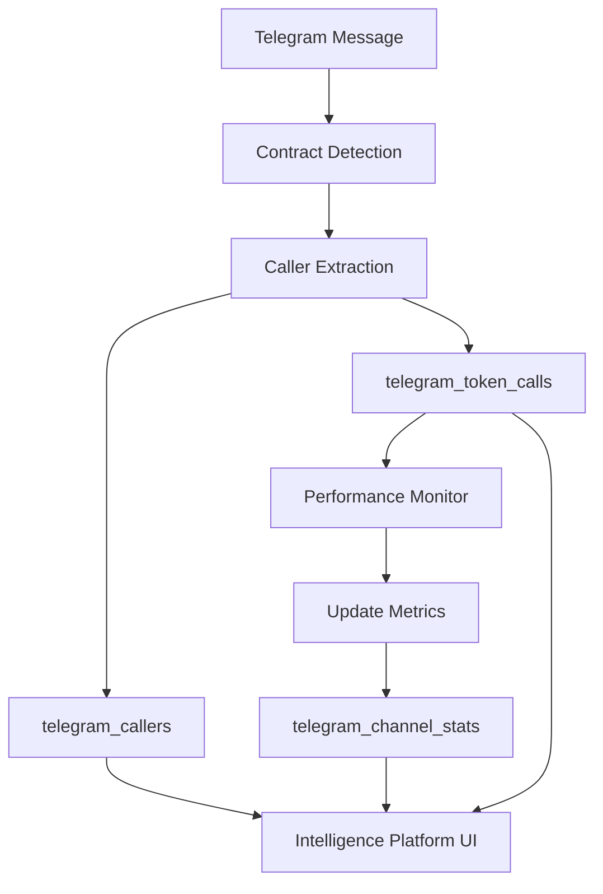

# Intelligence Platform - TODO

## 📊 Overview
The Intelligence Platform (`/intelligence`) is a standalone analytics tool for tracking Telegram caller/KOL performance and channel statistics. Currently **built but not connected** to live data flow.

## 🎯 Current Status

### ✅ What's Built
- [x] Frontend UI at `/intelligence` route
- [x] Database tables (telegram_callers, telegram_token_calls, telegram_channel_stats)
- [x] API endpoints for data retrieval
- [x] Caller profile cards with trust levels
- [x] Channel analytics views
- [x] Performance metrics calculations
- [x] WebSocket support for real-time updates

### ❌ What's Missing
- [ ] Automatic caller tracking when CA detected
- [ ] Performance follow-up on called tokens
- [ ] Integration with Telegram monitoring flow
- [ ] Data population from live messages
- [ ] Historical performance tracking

## 🔧 Implementation Tasks

### Phase 1: Connect Data Collection
- [ ] **Modify TelegramClientService** to capture caller data
  ```typescript
  // When contract detected in processMessage():
  - Extract sender information (ID, username, premium status)
  - Store in telegram_callers table
  - Link contract to caller in telegram_token_calls
  ```

- [ ] **Add Caller Tracking Function**
  ```typescript
  async trackCaller(message: TelegramMessage) {
    // Extract: senderId, username, firstName, lastName
    // Check: isPremium, isVerified, isBot
    // Store: telegram_callers table
    // Return: callerId for linking
  }
  ```

- [ ] **Log Token Calls**
  ```typescript
  async logTokenCall(contractAddress: string, callerId: number, message: any) {
    // Store: contract, caller, timestamp, message text
    // Track: initial price/mcap if available
    // Link: to chat_id for channel stats
  }
  ```

### Phase 2: Performance Tracking
- [ ] **Create Performance Monitor Service**
  - Poll token performance after calls (1h, 6h, 24h, 7d)
  - Update telegram_token_calls with ATH, current price
  - Calculate multipliers and success metrics
  - Update caller win rates

- [ ] **Implement Channel Stats Aggregator**
  - Calculate success rate per channel
  - Track volume generated
  - Identify top performing channels
  - Update telegram_channel_stats hourly

### Phase 3: Enhanced Detection
- [ ] **Confidence Scoring**
  - Analyze message patterns (hype words, emojis)
  - Check for coordinated campaigns
  - Score call confidence (0-100%)
  - Flag suspicious patterns

- [ ] **Call Type Detection**
  - Identify: Launch calls, pump calls, exit calls
  - Track different call types per caller
  - Analyze success by call type

### Phase 4: UI Enhancements
- [ ] **Caller Detail Pages** (`/intelligence/caller/:id`)
  - Full call history
  - Performance over time chart
  - Associated channels list
  - Trust score breakdown

- [ ] **Channel Deep Dive** (`/intelligence/channel/:id`)
  - Top callers in channel
  - Success rate trends
  - Volume analysis
  - Member overlap with other channels

- [ ] **Campaign Detection View**
  - Coordinated shill detection
  - Multi-channel campaign tracking
  - Timing analysis
  - Network visualization

## 📡 Data Flow Architecture



## 🗄️ Database Schema Utilization

### telegram_callers
```sql
- telegram_user_id (from message.senderId)
- username (from message.senderUsername)
- reputation_score (calculated)
- trust_level (calculated based on performance)
- win_rate (% of successful calls)
- total_calls (count)
```

### telegram_token_calls
```sql
- caller_id (FK to telegram_callers)
- contract_address (detected CA)
- call_timestamp (message.date)
- chat_id (source channel)
- initial_mcap (fetch on detection)
- ath_mcap (track over time)
- current_multiplier (calculate periodically)
```

### telegram_channel_stats
```sql
- chat_id (telegram chat)
- total_calls (aggregate)
- successful_calls (multiplier > 2x)
- channel_reputation (calculated)
- top_callers (JSON array)
```

## 🚀 Quick Start Implementation

### Step 1: Minimal Integration
```typescript
// In TelegramClientService.ts, after contract detection:
const callerId = await this.trackBasicCaller(message);
await this.logBasicCall(contractAddress, callerId, message.chatId);
```

### Step 2: Test Data Population
```bash
# Create test callers
curl -X POST /api/telegram/track-caller -d '{
  "telegramUserId": "123456",
  "username": "TestCaller",
  "isPremium": true
}'

# Log test calls
curl -X POST /api/telegram/log-call -d '{
  "callerId": 1,
  "contractAddress": "...",
  "chatId": "-100..."
}'
```

### Step 3: Verify UI
- Navigate to `/intelligence`
- Should see test data populated
- Verify calculations work

## 📈 Success Metrics

- [ ] Track 100+ unique callers
- [ ] Monitor 10+ active channels
- [ ] Achieve 80% accuracy in success prediction
- [ ] Identify 5+ coordinated campaigns
- [ ] Generate actionable intelligence reports

## 🎯 Decision Points

1. **Integration Level**
   - [ ] Keep as standalone analytics tool
   - [ ] Integrate into Telegram Sniffer tab
   - [ ] Make it a premium feature

2. **Data Collection**
   - [ ] Automatic for all detected CAs
   - [ ] Manual flagging of notable callers
   - [ ] Hybrid approach with filters

3. **Performance Tracking**
   - [ ] Real-time via WebSocket
   - [ ] Batch updates every hour
   - [ ] On-demand calculation

## 📅 Timeline Estimate

- **Phase 1**: 2-3 hours (Basic connection)
- **Phase 2**: 4-6 hours (Performance tracking)
- **Phase 3**: 6-8 hours (Enhanced detection)
- **Phase 4**: 8-10 hours (UI enhancements)

**Total**: ~20-27 hours for full implementation

## 🔗 Related Files

- Frontend: `src/components/SnifferIntelligence.tsx`
- Routes: `src/backend/routes/telegram-intelligence.ts`
- Database: Migrations 018 (caller tables)
- Service: TelegramClientService.ts (needs modification)

## 📝 Notes

- Intelligence Platform has huge potential for alpha generation
- Could become a key differentiator for the platform
- Consider monetization (premium intelligence access)
- Privacy considerations for tracking individual callers
- Need clear metrics for "success" definition

---

**Status**: 🟡 Built but not connected  
**Priority**: Medium-High (valuable but not critical)  
**Complexity**: Medium (mostly integration work)
